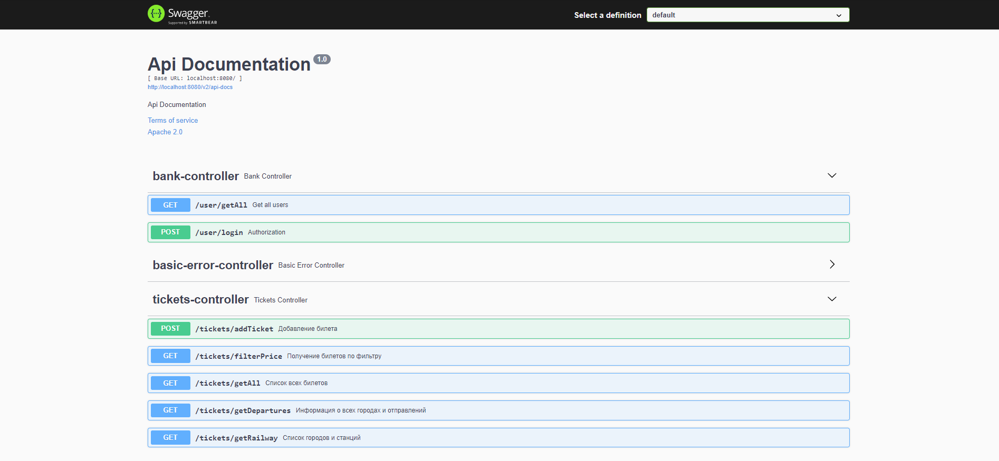

# Сервис по продаже жд билетов.

## Технологии и инструменты

## Реализованные проверки:

- [X] - tickets/getAll 
- [X] - tickets/getDepartures 
- [X] - tickets/getRailway
- [X] - tickets/addTicket
- [X] - tickets/filterPrice

#### После запуска сервиса доступен [Swagger](http://localhost:8080/swagger-ui/#/) с описанными методами :
